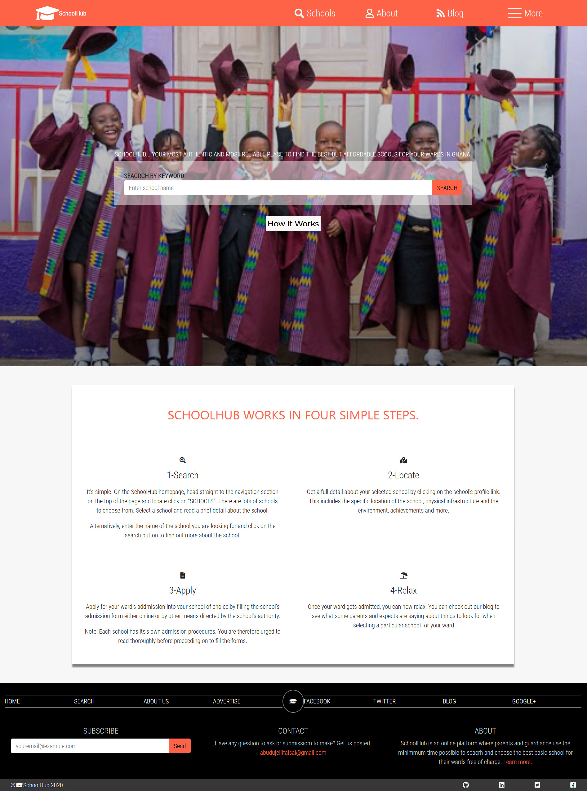

# Microverse HTML and CSS Capstone Project-school-directory
This is an assessment project on HTML and CSS technical curriculum for Microverse Program.

# Capstone project

Layout of  web page for study purpose

[Project Design](https://www.behance.net/gallery/25563385/PatashuleKE)

> This is a final project-Capstone Project for Microverse HTML and CSS Technical Curriculum. The goal is to build a web app using the PatashuleKE design prototype.  

## Additional description about the project and its features.
SchoolHub is a web app developed to help parents and guardiance find schools with ease for their wards.

For this reason, the home has a large search field for the user to enter the school he or she is looking for.
However, the user has another option to click on a navigation icon on the navbar to open a list of registered schools.

Another feature of the web app is the ability of the user to apply for sdmission directly from the page.

## Built With

- HTML,
- CSS,
- Bootstrap

## Live Demo

[My Video Presentation](https://www.loom.com/share/dd225feb57594ab183cf6c2254261394)
[Live Demo](https://raw.githack.com/JelilFaisalAbudu/html-and-css-capstone-school-directory/development/index.html)

## Getting Started

To get a local copy up and running follow these simple example steps.

### Prerequisites

- A compatible browser with HTML and CSS.

### Install

- Just clone the project

### Usage

- Open the index.html file in any browser or edit using Visual Code or the preference IDE for web development

## Author

👤 **Jelil Faisal Abudu**

- Github: 
- Twitter: 
- Linkedin: 

## 🤝 Contributing

Contributions, issues and feature requests are welcome!

Feel free to check the .

## Show your support

Give a ⭐️ if you like this project!

## Acknowledgments

- [mathewnjuguna](https://www.behance.net/mathewnjuguna)
- [aweSam](https://www.behance.net/aweSam)

## 📝 License

This project is free to use as learning purposes. For any external content (e.g. logo, images, ...), please contact the proper author and check their license of use.
